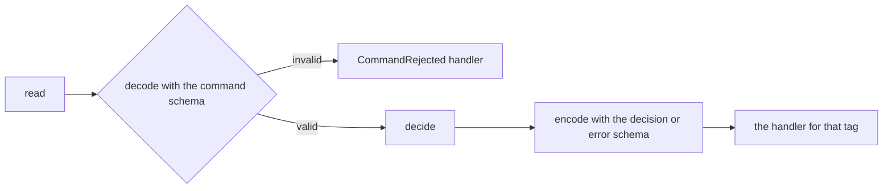

# @systemfsoftware/effect-cell-types

Build [Effect](https://effect.website) services as cells: a pure decision with I/O on either side of it, where the compiler checks the parts that are easy to get wrong.

A cell reads what it needs, decides, and writes the result. This package owns everything in between. It validates what was read against the workflow's command schema before the decision runs. It serializes the decision with the workflow's own schemas before any writing starts. And it only compiles the cell when the writer answers every outcome the decision can produce, plus malformed input. You write the reading, the pure decision, and one handler per outcome.

## Install

```bash
pnpm add @systemfsoftware/effect-cell-types effect@4.0.0-rc.116
```

`effect` is a peer dependency. The package targets Effect 4 and runs anywhere Effect runs.

## Quick start

A stock reservation. The decision reserves the stock, backorders it, or refuses the request; the cell reads stock levels from an inventory service and books the reservation.

```ts
import { Cell, Sandwich, Workflow } from '@systemfsoftware/effect-cell-types'
import { Context, Effect, Layer, Match, Result, Schema } from 'effect'

// 1. The command, the outcomes, and the refusal are schemas.
class ReserveStock extends Schema.TaggedClass<ReserveStock>()('ReserveStock', {
  sku: Schema.String,
  requested: Schema.Int,
  onHand: Schema.Int,
}) {
  // Fields copied onto the cell's trace span.
  static readonly [Workflow.InstrumentationBrand] = ['sku', 'requested'] as const
}

// Every outcome of one decision carries the same family brand.
const ReservationTypeId: unique symbol = Symbol.for('shop/Reservation')

class Reserved extends Schema.TaggedClass<Reserved>()('Reserved', {
  sku: Schema.String,
  quantity: Schema.Int,
}) {
  readonly [ReservationTypeId] = ReservationTypeId
}

class Backordered extends Schema.TaggedClass<Backordered>()('Backordered', {
  sku: Schema.String,
  short: Schema.Int,
}) {
  readonly [ReservationTypeId] = ReservationTypeId
}

class InvalidQuantity extends Schema.TaggedError<InvalidQuantity>()('InvalidQuantity', {
  requested: Schema.Int,
}) {}

// 2. The decision: synchronous and pure, with no services and no I/O.
const reserveStock = Workflow.make({
  command: ReserveStock,
  decision: Schema.Union([Reserved, Backordered]),
  error: InvalidQuantity,
  decide: ({ sku, requested, onHand }) =>
    Match.value(requested).pipe(
      Match.when((n) => n <= 0, () => Result.fail(new InvalidQuantity({ requested }))),
      Match.when((n) => n <= onHand, () => Result.succeed(new Reserved({ sku, quantity: requested }))),
      Match.orElse(() => Result.succeed(new Backordered({ sku, short: requested - onHand }))),
    ),
})

class Inventory extends Context.Service<Inventory, {
  readonly onHand: (sku: string) => Effect.Effect<number>
  readonly reserve: (sku: string, quantity: number) => Effect.Effect<void>
}>()('Inventory') {}

// 3. The cell: read the command, decide, write one handler per outcome.
const reserveCell = Sandwich.named('inventory.reserve')((order: { readonly sku: string; readonly quantity: number }) =>
  Effect.flatMap(Inventory, (inventory) =>
    Effect.map(inventory.onHand(order.sku), (onHand) => ({
      _tag: 'ReserveStock' as const,
      sku: order.sku,
      requested: order.quantity,
      onHand,
    })))
)
  .decide(reserveStock)
  .write({
    Reserved: ({ sku, quantity }) =>
      Effect.flatMap(
        Inventory,
        (inventory) => Effect.as(inventory.reserve(sku, quantity), `reserved ${quantity} x ${sku}`),
      ),
    Backordered: ({ sku, short }) => Effect.succeed(`backordered ${sku}: ${short} short`),
    InvalidQuantity: ({ requested }) => Effect.succeed(`refused: cannot reserve ${requested}`),
    CommandRejected: ({ issue }) => Effect.fail(new Error(issue)),
  })

// 4. Wire the services once, then run the cell as often as you like.
const InventoryInMemory = Layer.sync(Inventory, () => {
  const stock = new Map([['mug', 3]])
  return {
    onHand: (sku) => Effect.sync(() => stock.get(sku) ?? 0),
    reserve: (sku, quantity) => Effect.sync(() => stock.set(sku, (stock.get(sku) ?? 0) - quantity)),
  }
})

const program = Effect.gen(function*() {
  const context = yield* Layer.build(InventoryInMemory)
  const reserve = Cell.provideContext(reserveCell, context)
  return yield* Effect.forEach(
    [{ sku: 'mug', quantity: 2 }, { sku: 'mug', quantity: 2 }, { sku: 'mug', quantity: 0 }],
    (order) => reserve.run(order),
  )
})

Effect.runPromise(Effect.scoped(program)).then(console.log)
// [ 'reserved 2 x mug', 'backordered mug: 1 short', 'refused: cannot reserve 0' ]
```

A quantity of `1.5` never reaches the decision. It fails the command schema, so the `CommandRejected` handler runs with the schema's message, `Expected an integer at ["requested"]`.

Delete any one handler from `.write({ ... })` and the file no longer compiles.

## How a run works

Every run is one pass through five phases. You write three of them; the library runs the other two from the workflow's schemas, so neither can be skipped.



| Phase    | Written by | What happens                                                                                          |
| -------- | ---------- | ----------------------------------------------------------------------------------------------------- |
| `read`   | you        | an `Effect` that gathers the command in its serialized (`Encoded`) form; it may use services and fail |
| `decode` | library    | the workflow's command schema validates what `read` returned; a failure goes to `CommandRejected`     |
| `decide` | you        | the workflow's pure `decide` function returns a `Result` of a decision or a domain error              |
| `encode` | library    | the decision or error is serialized with its own schema, so handlers never see domain class instances |
| `write`  | you        | the handler whose key is the outcome's `_tag` runs; its answer is the cell's answer                   |

Each handler receives the encoded outcome and, as its second argument, exactly what `read` returned. A cell's answer is whatever its handlers return, and its error and service channels are the union of what `read` and every handler can fail with or need. The phases are recorded on the cell as `cell.phases`.

## Decisions

`Workflow.make({ command, decision, error, decide })` is the only way to build a decision, and `.decide(...)` accepts nothing else. The value it returns is still a plain function, `(command) => Result<Decision, Error>`, so you can call it directly and property-test it without a cell.

A decision takes one of two shapes:

- **One outcome per run.** `decision` is a union of tagged classes, like `Reserved | Backordered` above. The decision must choose between at least two outcomes, counting its errors, so a single success class is fine when `error` can happen. Use `error: Schema.Never` for a decision that cannot fail.
- **A list of events per run.** `decision` is `Schema.Array(Schema.Union([...]))`. The run produces zero or more past-tense facts, and the cell's answer is the list of handler answers, in order. Handlers run one after another and the first failure stops the rest; earlier handlers have already done their work.

```ts
const placeOrder = Workflow.make({
  command: PlaceOrder,
  decision: Schema.Array(Schema.Union([OrderPlaced, ReceiptRequested])),
  error: Schema.Never,
  decide: ({ orderId, email }) =>
    Result.succeed([
      new OrderPlaced({ orderId }),
      ...(email === undefined ? [] : [new ReceiptRequested({ orderId, email })]),
    ]),
})
// a cell over placeOrder answers ['placed o-1', 'receipt to ada@example.com']
```

The compiler refuses a decision that breaks these rules. Each refusal names the fix in the error message:

| You wrote                                                        | The error names                               |
| ---------------------------------------------------------------- | --------------------------------------------- |
| a `decide` that returns an `Effect` instead of a `Result`        | a `Result` mismatch                           |
| a `decision` of `Schema.Boolean`, or an outcome without a `_tag` | `UntaggedDecision`                            |
| one success class and `error: Schema.Never`                      | `SingleVariantDecision`                       |
| outcome classes without a shared family brand                    | `UnsharedTypeId`                              |
| an error without a `_tag`                                        | `UntaggedError`                               |
| a `decision` of `Schema.Never`                                   | `UninhabitedDecision`                         |
| a command class without `[Workflow.InstrumentationBrand]`        | the missing `[InstrumentationBrand]` property |
| a brand key that is not a field of the command                   | `InvalidInstrumentationKey`                   |
| a `read` whose result cannot be the command's `Encoded` form     | `ReadNotEncoded` or a type mismatch           |
| a `write` missing a handler, or a handler typed on the class     | a missing property or parameter mismatch      |

## Services

Build the services once, where your program starts, and hand the result to the cell with `Cell.provideContext`. The context is not rebuilt on each run, so a scoped resource (a connection pool, a file handle) opens once and closes when the scope that built it closes.

```ts
const program = Effect.gen(function*() {
  const context = yield* Layer.build(AppLayer) // once
  const reserve = Cell.provideContext(reserveCell, context)
  // run `reserve` as many times as needed
})
Effect.runPromise(Effect.scoped(program))
```

## Polling and retries

A cell is always one pass. To poll or retry, repeat `cell.run` with Effect's own schedules and let the decision's tag say when to stop:

```ts
import { Effect, Predicate, Schedule } from 'effect'

const awaitReady = (target: Target) =>
  probeCell.run(target).pipe(
    Effect.repeat({ schedule: Schedule.spaced('500 millis'), until: Predicate.isTagged('Ready') }),
    Effect.timeoutOrElse({ duration: '30 seconds', orElse: () => Effect.succeed({ _tag: 'TimedOut' as const }) }),
  )
```

Each pass is its own run, with its own span and duration sample.

## Composing cells

Cells are pipeable and combine with the functions on `Cell`:

| Function                                         | What it does                                                                                  |
| ------------------------------------------------ | --------------------------------------------------------------------------------------------- |
| `map`, `mapInput`                                | change a cell's answer, or adapt its input                                                    |
| `andThen`                                        | feed one cell's answer to the next cell, or pick the next cell from the answer                |
| `flatMap`                                        | run a second cell on the same input, chosen from the first answer                             |
| `zip`, `zipWith`                                 | run two cells on the same input and pair or combine their answers                             |
| `gate`                                           | run a second cell only when the first answers `Option.some`                                   |
| `collect`, `collectAll`                          | run a cell over a list; stop at the first failure, or keep every outcome                      |
| `mapError`, `orElse`, `tap`, `match`             | react to failures of `read` or a handler, observe answers, or fold both into one              |
| `provideContext`                                 | supply services built once                                                                    |
| `succeed`, `fail`, `fromEffect`, `suspend`, `id` | cells that answer a constant, fail, lift an `Effect`, build lazily, or pass the input through |
| `Do`, `bind`, `bindTo`, `let`                    | collect several cells' answers into one named record                                          |

```ts
import { Cell } from '@systemfsoftware/effect-cell-types'
import { pipe } from 'effect'

const summary = pipe(
  Cell.Do,
  Cell.bind('reservation', () => reserveCell),
  Cell.let('length', ({ reservation }) => reservation.length),
)
// with Inventory provided, summary.run({ sku: 'mug', quantity: 2 }) answers { reservation: 'reserved 2 x mug', length: 16 }
```

Only failures of `read` and of handlers reach `mapError`, `orElse`, and the failure side of `match`. A domain error from the decision is an outcome with its own handler, so it arrives as an answer.

## Telemetry

The name given to `Sandwich.named` must be a string literal without a unit suffix; the compiler rejects `'order_ms'` or a variable of type `string`. Each run then records:

- a span with that name, with child spans `<name>.read` and `<name>.write`, and the command fields listed in `[Workflow.InstrumentationBrand]` as attributes;
- the span attribute `decision` or `failure` with the outcome's tag;
- a duration histogram `app.<name>.duration` in seconds, labelled `result_class`: `success` when a decision was written, `failure` for a domain error or `CommandRejected`, `infrastructure` when `read` or a handler failed.

The histogram uses `Sandwich.DEFAULT_DURATION_BOUNDARIES` unless you pass `{ boundaries }` as the second argument to `Sandwich.named`.

## Contributing

The package lives in the [systemfsoftware monorepo](https://github.com/systemfsoftware/systemfsoftware/tree/main/packages/effect-cell-types). Issues and pull requests are welcome there; see [CONTRIBUTING.md](../../CONTRIBUTING.md) for how changes are checked and released.

## License

[Apache-2.0](./LICENSE)
